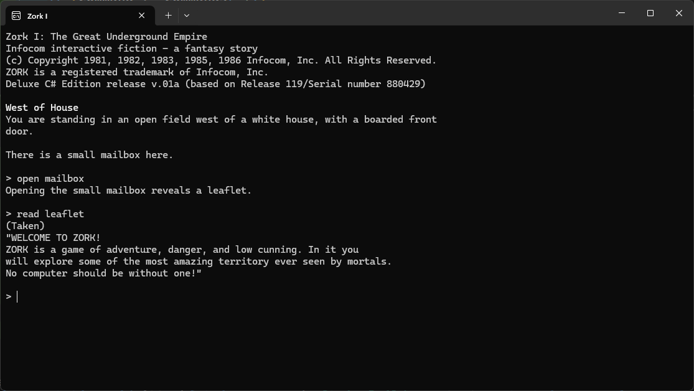
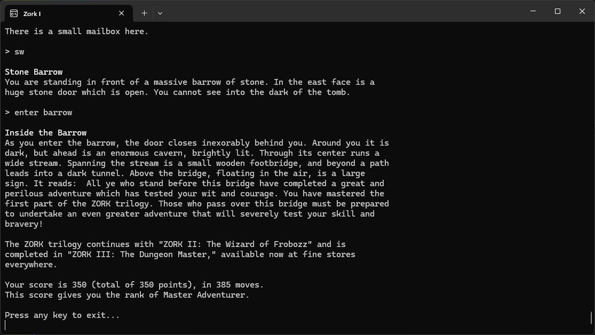

Zork 1 in C#
=============
*Pull requests are welcome. I would love your help!*

This is my ongoing effort to write Zork 1 in C#. The game is complete, but surely has bugs.

I started by downloading the Zork 1 .z3 file (revision 119) from [The Obsessively Complete Infocom Catalog](https://eblong.com/infocom/) and using the 
[Reform 6 Z-Code Decompiler](https://www.ifarchive.org/indexes/if-archive/infocom/tools/reform/) (along with the 
appropriate [symbol files](https://github.com/allengarvin/reform-conf)) to create an Inform 6 source file - which, to me is 
much easier to understand than ZIL (although I did have to refer to the original ZIL source many, many times).

At this time, the game is playable and winnable.



Some Notes
----------------
**The Parser**

The "game code" is 100% from the original game, but the parser is mine. I am not aiming for 1-to-1 parity, where I capture every bizarre nuance of the parser. But the parser should work very
similar to the original (complex input, multiple commands, partial responses, etc., etc.) and this version of the game should be playable, complete and feel very much like the original Zork.

**Bugs**

The original Zork contains many bugs (in addition to mine :)) and there is a list of them that is
at [The Infocom Files](https://github.com/the-infocom-files/zork1/issues). I have tried to go through and fix as many
of them as possible.

**Tests**

Most of the unit tests are centered around the parser. At this time, I have only manually tested the various 
scenarios in the game. 

**Dead Code**

There is some dead code in the original game and I have mostly left that in. Noteably, combat messages for
the cyclops. As far as I can tell, you can never actually fight the cyclops.

**Newlines/Whitespace**

I have added newlines and whitespace in many places to make the game easier...on my eyes. There will surely be differing opinions here. 

**Object Describers**

I have made many changes to the various "describers" in the game. For instance, the initial description of the objects in the
kitchen looks like this:
```
A bottle sitting on a table.
The glass bottle contains:
  A quantity of water
On the table is an elongated brown sack, smelling of hot peppers.
```

I prefer a more Inform-like describer so that is what I am doing:
```
On the table is an elongated brown sack, smelling of hot peppers.
A bottle (which contains a quantity of water) is sitting on the table.
```
